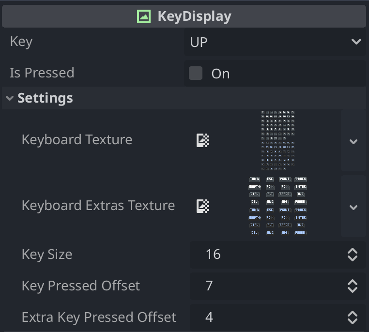
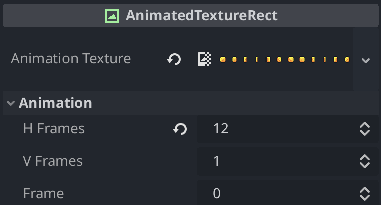

# Godot Tools Showcase

This repository contains two custom tools for Godot: **KeyDisplay** and **AnimatedTextureRect**. These tools provide custom nodes to improve UI work. The repository also includes example scenes to demonstrate how to use each tool.

## Tools Overview

### KeyDisplay

[`KeyDisplay`](./tools/key_display_readme.md) is a Godot tool that provides an easy way to render keys inside the UI. It uses textures from [dreammix](https://dreammix.itch.io/keyboard-keys-for-ui) for the showcase but can be adapted to any texture with code modifications.

[DEMO](https://koppigames.itch.io/keydisplay)

#### Properties

- **key**: The key to be rendered. Options include all keys from [dreammix](https://dreammix.itch.io/keyboard-keys-for-ui)'s textures.
- **is_pressed**: Determines if the key is rendered as pressed.
- **keyboard_texture**: Texture for regular keys.
- **keyboard_extras_texture**: Texture for extra keys.
- **key_size**: Size of each key.
- **key_pressed_offset**: Number of vertical keys before pressed textures.
- **extra_key_pressed_offset**: Number of vertical extra keys before pressed textures.

### AnimatedTextureRect

[`AnimatedTextureRect`](./tools/AnimatedTextureRect) provides an easy way to animate with spritesheets inside the UI.

[Showcase](https://koppigames.itch.io/animatedtexturerect)

#### Properties

- **animation_texture**: The animated Texture2D resource.
- **h_frames**: The number of columns in the sprite sheet.
- **v_frames**: The number of rows in the sprite sheet.
- **frame**: Current frame to display from sprite sheet. `h_frames` or `v_frames` must be greater than 1.

## Example Scenes

The repository includes two example scenes demonstrating the usage of the tools:

- [`key_display_example.tscn`](./scenes/key_display_example.tscn): Showcases the `KeyDisplay` tool.
- [`animated_texture_rect_example.tscn`](./scenes/animated_texture_rect_example.tscn): Showcases the `AnimatedTextureRect` tool.

## Installation

To use these tools in your project, copy the [`key_display.gd`](./tools/KeyDisplay) and [`animated_texture_rect.gd`](./tools/animated_texture_rect.gd) scripts to your project and add the corresponding nodes to your scenes.

## Usage

### KeyDisplay

1. Add a `KeyDisplay` node to your scene.
2. Configure the properties in the Inspector to set the key, textures, and other settings.

### AnimatedTextureRect

1. Add an `AnimatedTextureRect` node to your scene.
2. Configure the properties in the Inspector to set the animation texture, frames, and other settings.
3. Add an `AnimationPlayer` node to your scene.
4. Configure your animation to feet your needs.

## License

This project is licensed under the MIT License. See the [LICENSE](LICENSE) file for details.
