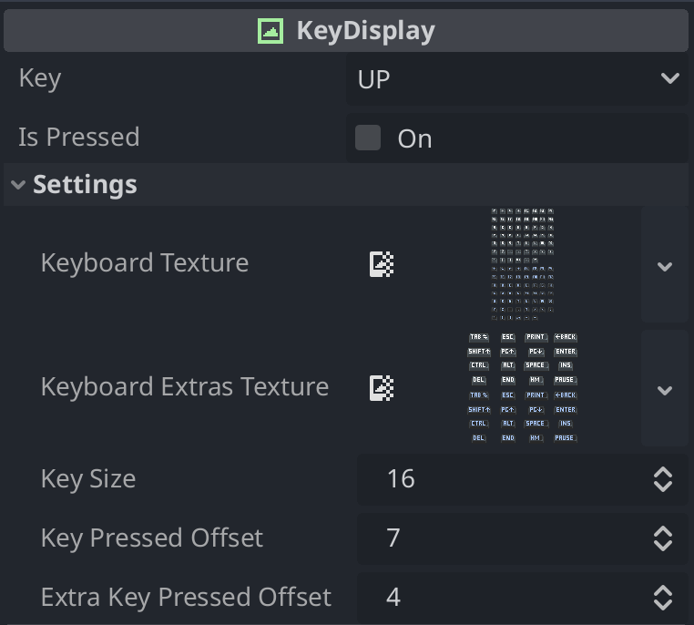
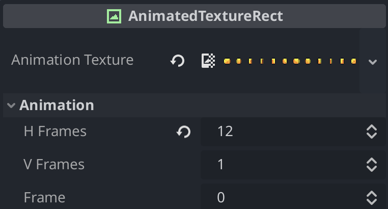
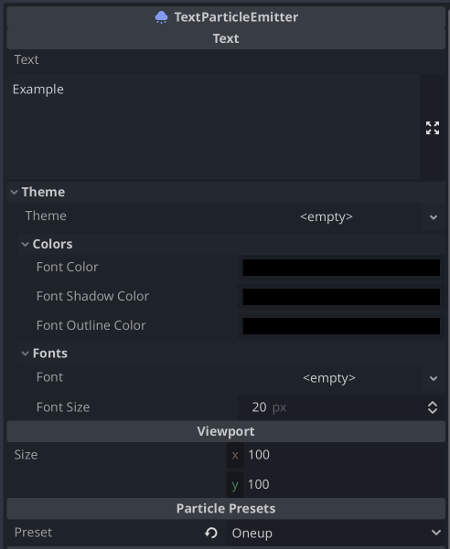

# Godot Tools Showcase

This repository contains three custom tools for Godot: **KeyDisplay**, **AnimatedTextureRect**, and **TextParticleEmitter**. These tools provide custom nodes to improve UI work. The repository also includes example scenes to demonstrate how to use each tool.

## Tools Overview

### KeyDisplay

[`KeyDisplay`](./tools/KeyDisplay) is a Godot tool that provides an easy way to render keys inside the UI. It uses textures from [dreammix](https://dreammix.itch.io/keyboard-keys-for-ui) for the showcase but can be adapted to any texture with code modifications.

[DEMO](https://koppigames.itch.io/keydisplay)

#### Properties

- **key**: The key to be rendered. Options include all keys from [dreammix](https://dreammix.itch.io/keyboard-keys-for-ui)'s textures.
- **is_pressed**: Determines if the key is rendered as pressed.
- **keyboard_texture**: Texture for regular keys.
- **keyboard_extras_texture**: Texture for extra keys.
- **key_size**: Size of each key.
- **key_pressed_offset**: Number of vertical keys before pressed textures.
- **extra_key_pressed_offset**: Number of vertical extra keys before pressed textures.

### AnimatedTextureRect

[`AnimatedTextureRect`](./tools/AnimatedTextureRect) provides an easy way to animate with spritesheets inside the UI.

[Showcase](https://koppigames.itch.io/animatedtexturerect)

#### Properties

- **animation_texture**: The animated Texture2D resource.
- **h_frames**: The number of columns in the sprite sheet.
- **v_frames**: The number of rows in the sprite sheet.
- **frame**: Current frame to display from sprite sheet. `h_frames` or `v_frames` must be greater than 1.

### TextParticleEmitter

[`TextParticleEmitter`](./tools/TextParticleEmitter) is a Godot tool that renders dynamic text as particles using a `SubViewport` and `GPUParticles2D`. You can customize text, themes, fonts, and particle effects to create engaging visualizations. It's perfect for adding dynamic text effects to your UI.

[Showcase](https://koppigames.itch.io/textparticleemitter)

#### Properties

##### Text
- **text**: The text to be rendered.

##### Theme
- **theme**: The theme for the label rendering the text.

##### Theme Overrides
###### Colors
- **font_color**: The color of the text font.
- **font_shadow_color**: The color of the text's shadow, if any.
- **font_outline_color**: The color of the text's outline, if any.

###### Fonts
- **font**: The font used for rendering the text.
- **font_size**: The size of the font, in pixels.

##### Viewport
- **size**: The size of the viewport used to render the text.

##### Particle Presets
- **preset**: The particle effect preset, which can be `CUSTOM`, `ONEUP`, or `EXPLOSION`.

### Signals

All properties emit the `value_change` signal when modified.

## Example Scenes

The repository includes three example scenes demonstrating the usage of the tools:

- [`key_display_example.tscn`](./scenes/key_display_example.tscn): Showcases the `KeyDisplay` tool.
- [`animated_texture_rect_example.tscn`](./scenes/animated_texture_rect_example.tscn): Showcases the `AnimatedTextureRect` tool.
- [`text_particle_emitter_example.tscn`](./scenes/text_particle_emitter_example.tscn): Showcases the `TextParticleEmitter` tool.

## Installation

To use these tools in your project, copy the following scripts to your project and add the corresponding nodes to your scenes:

- [`key_display.gd`](./tools/KeyDisplay)
- [`animated_texture_rect.gd`](./tools/animated_texture_rect.gd)
- [`text_particle_emitter.gd`](./tools/TextParticleEmitter)

## Usage

### KeyDisplay

1. Add a `KeyDisplay` node to your scene.
2. Configure the properties in the Inspector to set the key, textures, and other settings.

### AnimatedTextureRect

1. Add an `AnimatedTextureRect` node to your scene.
2. Configure the properties in the Inspector to set the animation texture, frames, and other settings.
3. Add an `AnimationPlayer` node to your scene.
4. Configure your animation to fit your needs.

### TextParticleEmitter

1. Add a `TextParticleEmitter` node to your scene.
2. Configure the text, theme, font, and colors using the properties.
3. Select a particle effect preset (`CUSTOM`, `ONEUP`, `EXPLOSION`), or manually configure your own particle material.

## License

This project is licensed under the MIT License. See the [LICENSE](LICENSE) file for details.
